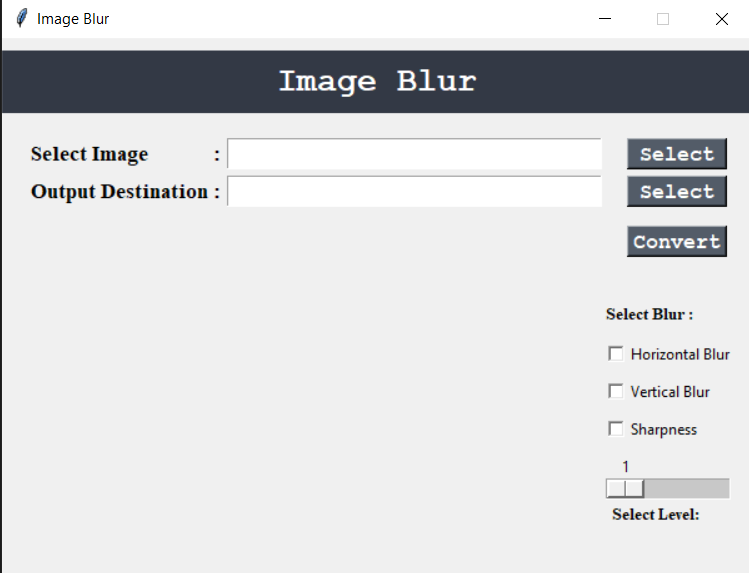
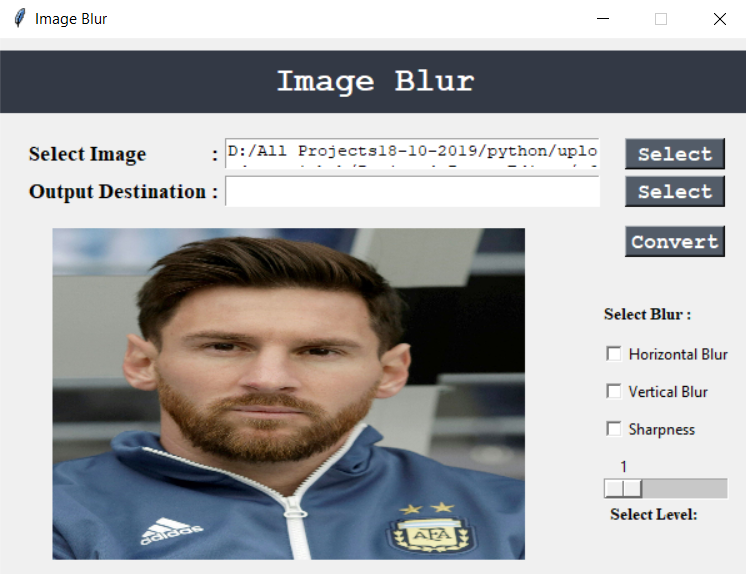
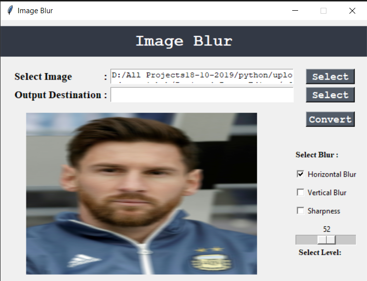
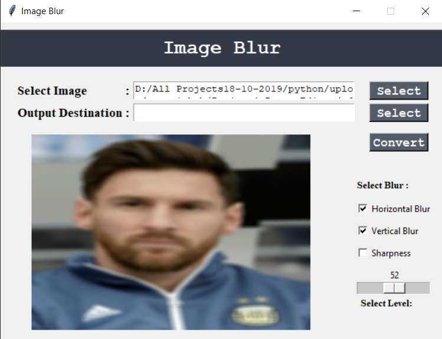
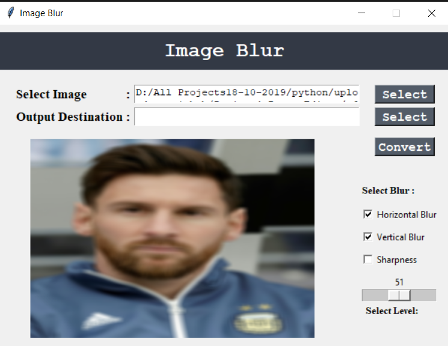
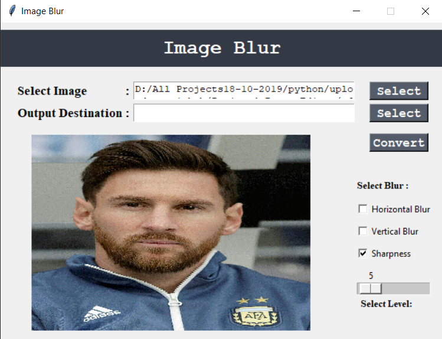

# CV2-IMAGE-EDITOR
  - CV2 Photo Editor in Python 3 with Tkinter UI.
 
# Features
  - Image Blur (Separated) :
      - Horizontal Blur
      - Vertical Blur
  - Image Sharpen
  
# Requirements
  - Python 3
  - CV2 and PIL Library

# Usage
   - Clone or Download this repository.
   - Run MainModule.py.
   - Select desired Image.
   - Apply desired image filter.
   - Select Output Folder to save resultant image.

# Credits
  
  - Created by Kamlesh Pandey.

# Screenshots

